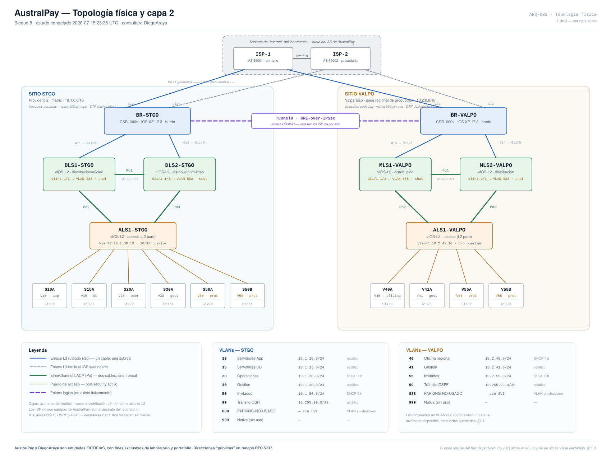

# AustralPay — Red empresarial de dos sedes

**Red de dos sedes en EVE-NG probada flujo por flujo: 59/59 pruebas de conectividad y failover medido con tráfico continuo.**

> ⚠️ **AustralPay y la consultora DiegoAraya son entidades FICTICIAS, creadas exclusivamente con fines de laboratorio y portafolio. Ninguna dirección, dispositivo, ISP o dato descrito corresponde a una red, cliente o proveedor real. Este proyecto no fue trabajo para un cliente real.**

- **59/59** en la matriz de conectividad, probando lo permitido *y* lo bloqueado, con la predicción escrita antes de cada prueba.
- **Failover medido con ping continuo:** ~129 s al caer un ISP (detección estándar de BGP; BFD queda propuesto para producción) y ~5 s al caer un switch de distribución.
- **11 discrepancias** entre el diseño documentado y los equipos reales, encontradas y corregidas, con la causa de cada una registrada.
- **7 ACLs de lista blanca** (denegar por defecto) para la segmentación por VLAN, incluida la separación app/base de datos.

---

Diseño, implementación y **verificación completa** de la red corporativa de una fintech ficticia con dos sedes: matriz en Santiago y sede regional de producción en Valparaíso. Construida desde cero sobre EVE-NG con equipos Cisco, a lo largo de ocho bloques de trabajo, cada uno cerrado con su verificación y su documentación.

No es una topología que "funciona". Es una red **probada flujo por flujo** —matriz de conectividad de 59 pruebas, failover medido con tráfico continuo— y un bloque de validación final que encontró **once discrepancias entre el diseño documentado y los equipos reales, las corrigió, y registró por qué cada una ocurrió**. Ese registro es el núcleo del proyecto: no confiar en que "todo está verde", sino probar el conjunto y perseguir la diferencia.

---

## La red de un vistazo

```
        ISP-1 (AS 65001)          ISP-2 (AS 65002)
             │   └──────┐    ┌──────┘   │
             │          │    │          │
      ┌──────┴──────┐   │    │   ┌──────┴──────┐
      │   BR-STGO   │◄──┴────┴──►│  BR-VALPO   │
      │  (borde)    │  túnel GRE │  (borde)    │
      └──────┬──────┘  over IPSec└──────┬──────┘
             │          AES-256         │
     ┌───────┴───────┐         ┌───────┴───────┐
     │ DLS1 ── DLS2  │         │ MLS1 ── MLS2  │  distribución/núcleo
     │  (HSRP · L3)  │         │  (HSRP · L3)  │  (collapsed core)
     └───────┬───────┘         └───────┬───────┘
             │                         │
         ┌───┴───┐                 ┌───┴───┐
         │ ALS1  │                 │ ALS1  │       acceso
         └───────┘                 └───────┘
         SANTIAGO                  VALPARAÍSO
      10.1.0.0/16                10.2.0.0/16
```

**Multihoming BGP** a dos ISP por sede · **OSPF multiárea** (área 0 en el túnel, 1 en STGO, 2 en VALPO) · **VPN GRE-over-IPSec** cifrada · **redundancia por capa** (HSRP, EtherChannel, RPVST+) · **segmentación de seguridad** de lista blanca · IPv4 puro, RFC 5737 para el espacio público.



*Topología física y capa 2 ([ARQ-002](docs/ARQ-002_Topologia_Fisica.svg)). Distribución y HSRP en [ARQ-003](docs/ARQ-003_Distribucion_HSRP.svg); WAN, BGP y el túnel en [ARQ-004](docs/ARQ-004_WAN_BGP_VPN.svg).*

---

## Por dónde empezar

| Si buscas… | Ve a | Tiempo |
|---|---|---|
| **Qué demuestra el proyecto** | [`docs/AustralPay_Informe_Final_Maestro.md`](docs/AustralPay_Informe_Final_Maestro.md) | 5 min |
| **El diseño técnico y el porqué de cada decisión** | [`docs/ARQ-001_Arquitectura_AustralPay.md`](docs/ARQ-001_Arquitectura_AustralPay.md) | 30 min |
| **Cómo se verificó y qué se rompió a propósito** | [`informes/INF-001-B8_Verificacion_Entrega.md`](informes/INF-001-B8_Verificacion_Entrega.md) | 15 min |
| **La lectura de entrega al cliente** | [`docs/ENT-001_Informe_Entrega_AustralPay.md`](docs/ENT-001_Informe_Entrega_AustralPay.md) | 10 min |

---

## Qué demuestra este proyecto

- **Diseño de arquitectura** — *collapsed core* por sede (no un núcleo dedicado que sobraría a esta escala), OSPF multiárea con bordes ABR reales, dos sedes simétricas y multihomed. Incluye decisiones de *no* hacer, con argumento: un peering iBGP se planificó y luego se eliminó porque OSPF sobre el túnel ya lo resolvía.
- **Seguridad y segmentación** — política de lista blanca (denegar por defecto), separación app/base-de-datos como regla de detección, endurecimiento de capa 2 diferenciado por rol de puerto, plano de gestión endurecido. Y criterio sobre qué *no* filtrar: no se bloqueó ICMP, porque romper PMTUD cuelga el TCP sobre el túnel.
- **Enrutamiento y WAN** — multihoming BGP con manipulación de atributos (LocalPref, AS-path prepend) verificada surtiendo efecto real; default aprendida por BGP con NAT siguiendo al ruteo; túnel GRE-over-IPSec con OSPF corriendo por dentro.
- **Diagnóstico** — causa raíz documentada en cada incidente, y método sobre intuición: cada prueba de verificación se escribió con su resultado esperado *antes* de ejecutarla, lo que atrapó cerca de veinte predicciones propias equivocadas.
- **Verificación y entrega** — matriz de 59 pruebas (permitido *y* bloqueado), failover medido con ping continuo (ISP ~129 s, gateway interno ~5 s), 11 divergencias corregidas, y entrega profesional completa.

---

## Estructura del repositorio

```
.
├── README.md                    ← este archivo
├── docs/
│   ├── ARQ-001_Arquitectura_AustralPay.md   Diseño técnico completo + changelog
│   ├── ARQ-002_Topologia_Fisica.svg         Diagrama: topología física y capa 2
│   ├── ARQ-003_Distribucion_HSRP.svg        Diagrama: distribución, HSRP, estados de falla
│   ├── ARQ-004_WAN_BGP_VPN.svg              Diagrama: WAN, BGP y el túnel
│   ├── ENT-001_Informe_Entrega_AustralPay.md    Informe de entrega (lenguaje de cliente)
│   ├── PLAN-001_Comparativo_Plan_vs_Real.md     Plan inicial vs. resultado final
│   └── AustralPay_Informe_Final_Maestro.md      Resumen por competencias
├── informes/
│   ├── INF-001-B2_Capa2_STGO.md             Bloques 1-2: capa 2 STGO
│   ├── INF-001-B3_Capa3_STGO.md             Bloque 3: capa 3 STGO
│   ├── INF-001-B4_VALPO.md                  Bloque 4: sitio VALPO
│   ├── INF-001-B5_Borde_WAN.md              Bloque 5: borde, BGP, VPN
│   ├── INF-001-B6_Gestion_AAA.md            Bloque 6: plano de gestión y AAA
│   ├── INF-001-B7_Segmentacion_Servicios.md Bloque 7: segmentación y servicios
│   └── INF-001-B8_Verificacion_Entrega.md   Bloque 8: verificación y entrega
├── evidencias/
│   ├── EVID-001-B8_Verificacion.docx     Evidencia fotográfica del Bloque 8 (matriz, failover, VLAN 888, filtro inter-sitio)
│   └── README.md                          Estado de cobertura por bloque
└── configs/
    ├── *.txt                    Configuración final de los 8 equipos (sanitizada)
    └── README.md                Detalle de la sanitización y artefactos de fábrica
```

> El informe `INF-001-B2` cubre los Bloques 1 y 2: el Bloque 1 fue el diseño inicial, cuyo entregable es el propio documento de arquitectura. Las versiones intermedias del diseño (bloques 1 a 7) no se publican; su evolución está registrada en el changelog de `ARQ-001` y contrastada en `PLAN-001`.

---

## Stack

- **Emulación:** EVE-NG (sobre VMware Workstation)
- **Borde:** Cisco CSR1000v · IOS-XE 17.3 (BGP, NAT, crypto)
- **Interior:** Cisco vIOS-L2 · IOS 15.2 (switching multicapa)
- **Protocolos:** OSPFv2 multiárea, BGP-4, HSRPv2, RPVST+, LACP, GRE, IPSec (IKEv1), NTP
- **Documentación:** Markdown, diagramas SVG

---

> ⚠️ **AustralPay y DiegoAraya son ficticias, con fines exclusivos de laboratorio y portafolio. Este proyecto no fue trabajo para un cliente real.**
